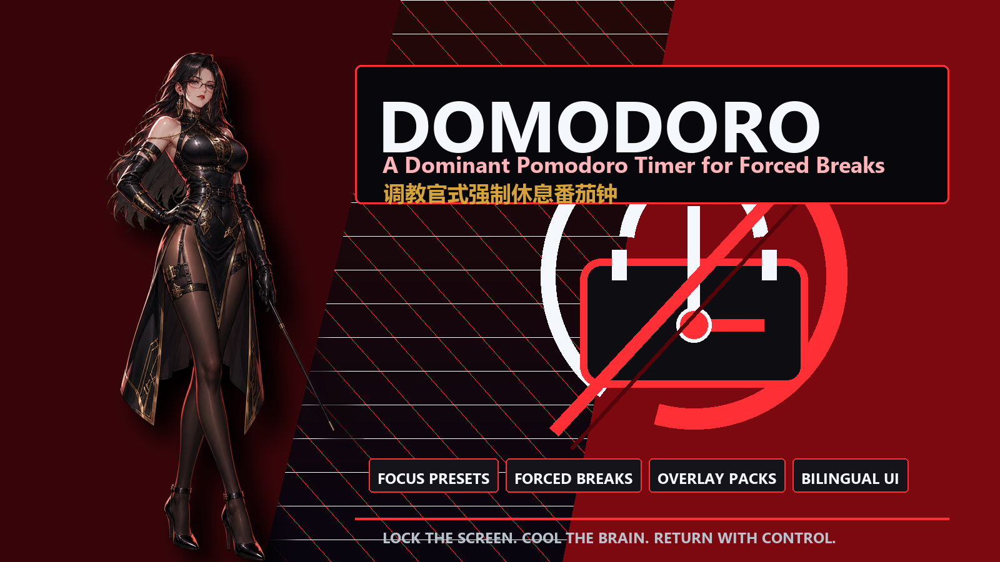

# Domodoro | 调教官式强制休息番茄钟



**English:** Domodoro is a Windows-first dominant Pomodoro timer that interrupts overfocus with full-screen, always-on-top break overlays and persona-driven feedback.

**中文：** Domodoro 是一款 Windows 优先的调教官式番茄钟，用全屏置顶遮罩和角色化反馈强制打断过度专注，帮助你按时休息、避免疲劳循环。

## Project Title / 项目标题

- **EN:** Domodoro: A Dominant Pomodoro Timer for Forced Breaks
- **ZH:** Domodoro：调教官式强制休息番茄钟

## Short Description / 简介

- **EN:** A dark, gamified focus timer for ADHD-friendly work loops, featuring bilingual UI, focus presets, local stats, emergency bypass, and extensible Overlay Packs.
- **ZH:** 一个暗黑游戏化的专注计时器，适合容易过度专注的工作流；支持中英界面、三档专注套餐、本地统计、紧急绕过和可扩展遮罩包。

## Features

- Windows tray-first Pomodoro timer.
- Chinese / English interface switch.
- Trainer-style focus presets: 20 / 40 / 60 minutes.
- One-minute visual warning before forced break.
- Full-screen always-on-top break overlays across displays.
- Post-break decision gate: continue, finish the day, or recover 5 more minutes.
- Random Overlay Packs per break.
- Built-in CSS scene packs.
- Custom video overlay via local file URL or HTTPS direct `.mp4`, `.webm`, `.mov`.
- Emergency bypass with password and required reason.
- Daily pause/snooze limit.
- Local-only settings and history.
- Optional startup on login.

## Download

Windows builds are published on the GitHub Releases page.

- Installer: `Domodoro Setup <version>.exe`
- Portable archive: `Domodoro-<version>-win.zip`

If no release is available yet, run from source with the commands below.

## 功能亮点

- Windows 托盘番茄钟。
- 中英文界面切换。
- 调教官风格三档专注套餐：20 / 40 / 60 分钟。
- 强制休息前 1 分钟可视化提醒。
- 多屏全屏置顶休息遮罩。
- 休息结束后可选择继续、收工或再休息 5 分钟。
- 每次休息随机抽取 Overlay Pack。
- 内置 CSS 动画遮罩主题。
- 支持本地视频或 HTTPS 视频直链遮罩。
- 紧急绕过需要密码和原因记录。
- 每日暂停/延长次数限制。
- 设置和历史只保存在本地。
- 支持开机自启动，默认关闭。

## 下载

Windows 版本会发布在 GitHub Releases 页面：

- 安装包：`Domodoro Setup <version>.exe`
- 便携压缩包：`Domodoro-<version>-win.zip`

如果暂时没有 Release，可以先按下面的本地运行方式启动。

## Run Locally

```bash
npm install
npm start
```

## Build Windows App

```bash
npm run dist
```

Build artifacts are written to `release/`.

## Test

```bash
npm test
```

## Documentation

- [Overlay Pack Guide](docs/OVERLAY_PACKS.md)
- [Roadmap](docs/ROADMAP.md)

## Overlay Pack Interface

Each pack lives in `src/overlays/<pack-id>/overlay-pack.json`.

```json
{
  "id": "cyber-alert",
  "name": "Cyber Alert",
  "type": "css-scene",
  "assets": {},
  "defaultText": ["Stand up.", "Let your brain cool down."],
  "sound": "pulse",
  "allowRandom": true
}
```

Supported `type` values:

- `css-scene`
- `video`
- `image`

Remote webpages, iframes, YouTube pages, and Bilibili pages are intentionally unsupported. Video overlays must be local `file://` media or HTTPS direct media links.

## Data & Limits

Domodoro stores `settings.json` and `history.json` in Electron's `userData` directory. No cloud sync is included.

Domodoro is a behavioral interrupt, not a system-level lock. It does not prevent Task Manager or system-level process termination.

## License

MIT
