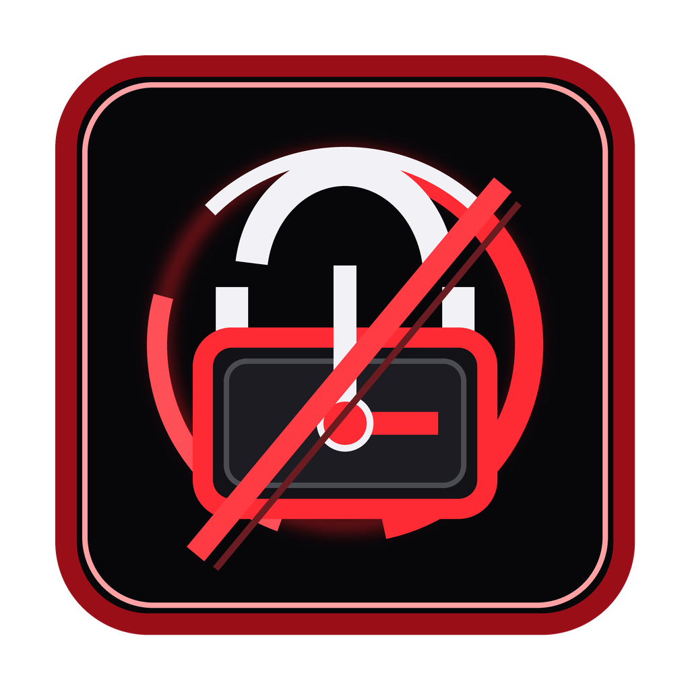
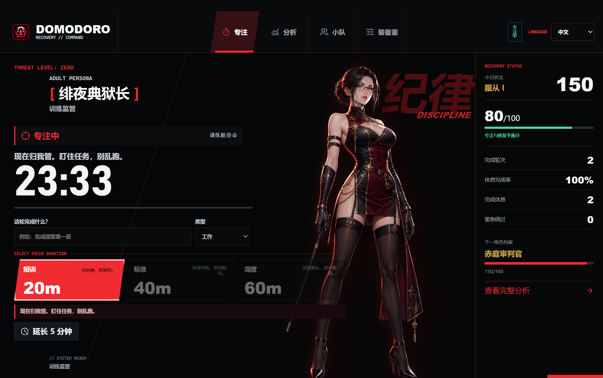

# Domodoro

<p align="center">
  
</p>

<p align="center">
  <strong>一款会强制打断过度专注的 Windows 番茄钟。</strong><br>
  在疲劳失控之前，按时停下来恢复。
</p>

<p align="center">
  <a href="README.md">English</a> · 简体中文
</p>

<p align="center">
  <a href="https://github.com/cnstan-bit/Domodoro/releases/latest"></a>
  <a href="https://github.com/cnstan-bit/Domodoro/actions/workflows/ci.yml"></a>
  <a href="LICENSE"></a>
  
</p>




## 为什么做 Domodoro

大多数番茄钟只会弹出一条小通知，然后等待你自觉停手。进入过度专注后，这种提醒很容易被直接忽略。

Domodoro 采用更强硬的方式：专注结束前一分钟先给出醒目的视觉预警；时间到后，在所有显示器上打开全屏置顶的恢复遮罩。计时核心保持简单，休息体验则通过 Overlay Pack 实现可配置和可扩展。

它适合容易忘记时间、难以主动停工的人，也考虑了 ADHD 用户的实际工作节奏。它是一种行为打断工具，不是医疗软件，也不是系统级锁机程序。

## 工作流程

1. 选择 20、40 或 60 分钟专注套餐。
2. 可选填写这一轮准备完成的任务。
3. 最后一分钟出现带角色立绘的可视化预警。
4. 专注结束后，所有显示器进入全屏置顶休息遮罩。
5. 休息完成后，选择继续下一轮、今天收工或再恢复 5 分钟。

退出程序会结束当前专注任务。再次打开时从空闲状态开始，不会悄悄续接旧任务。已经开始的强制休息仍会阻止普通窗口关闭绕过。

## 主要功能

### 专注与恢复

- 20、40、60 分钟三档专注套餐。
- 可配置短休、长休以及长休间隔。
- 强制休息前一分钟可视化预警。
- 多显示器全屏置顶恢复遮罩。
- 休息结束后的继续、收工、加休选择。
- 每日专注延长和额外恢复次数限制。
- 紧急绕过需要密码和原因，并写入本地记录。

### 遮罩引擎

- 从启用的 Overlay Pack 中随机抽取休息场景。
- 内置 HTML 和 CSS 动画主题。
- 支持静态图片和动态图片背景。
- 支持本地视频与 HTTPS 媒体直链。
- 视频或图片加载失败时自动回退到内置主题。
- 可配置主色、警告文案、音效和遮罩强度。

### 成长与分析

- 本地记录专注、休息、暂停和紧急绕过。
- 7 天和 30 天专注恢复分析。
- 奖励按时休息而不是鼓励过劳的平衡积分。
- 纪律等级和角色档案成长进度。
- 每周分享卡片。
- 可选的隐私优先小队与每日汇总排行榜。

### Windows 体验

- 基于 Electron 的托盘应用。
- 主界面右上角切换中文或英文。
- 托盘菜单只显示当前状态可用的操作。
- 支持开机自动启动，默认关闭。
- 提供安装包和便携压缩包。
- 支持减少动态效果。

## 下载

前往 [GitHub Releases](https://github.com/cnstan-bit/Domodoro/releases/latest) 下载最新版 Windows 程序：

- `Domodoro Setup <version>.exe`：标准安装包。
- `Domodoro-<version>-win.zip`：便携压缩包。

由于社区构建目前没有商业代码签名证书，Windows 可能显示 SmartScreen 提示。对此有顾虑时，可以先检查源代码和自动发布流程，再决定是否运行。

## 从源代码运行

环境要求：

- Windows
- Node.js 22 或更高版本
- npm

```powershell
git clone https://github.com/cnstan-bit/Domodoro.git
cd Domodoro
npm install
npm start
```

## 构建 Windows 安装包

```powershell
npm run dist
```

安装包、便携压缩包和解包后的程序会生成到 `release/`。

## 开发 Overlay Pack

每个遮罩包位于 `src/overlays/<pack-id>/`，并包含一个 `overlay-pack.json`：

```json
{
  "id": "cyber-alert",
  "name": "Cyber Alert",
  "type": "css-scene",
  "assets": {},
  "defaultText": ["站起来。", "让大脑冷却一下。"],
  "sound": "pulse",
  "allowRandom": true
}
```

支持的类型：

| 类型 | 用途 |
| --- | --- |
| `css-scene` | 使用内置 HTML 和 CSS 动画的主题 |
| `image` | 静态图片或动态图片背景 |
| `video` | 本地视频或 HTTPS 媒体直链 |

出于安全和稳定考虑，程序不会加载远程网页、iframe、任意第三方 JavaScript、YouTube 页面或 B 站页面。视频来源必须是 `file://` 本地媒体，或 HTTPS 的 `.mp4`、`.webm`、`.mov` 直链。

完整字段和测试流程见 [Overlay Pack 开发指南](docs/OVERLAY_PACKS.md)。

## 本地数据与隐私

Domodoro 默认可以完全离线使用。Windows 上的应用数据通常保存在 `%APPDATA%\domodoro\`。

| 文件 | 内容 |
| --- | --- |
| `settings.json` | 计时、遮罩、角色和界面设置 |
| `history.json` | 专注、休息、暂停和绕过历史 |
| `session-state.json` | 强制休息期间使用的临时状态 |
| `social-session.dat` | 可选社交登录的加密会话 |

任务名称、任务类型、绕过原因、精确时间、遮罩选择和角色选择只保存在本机。启用小队后，也只会同步每日汇总指标。详细边界见 [小队后端说明](docs/SOCIAL.md)。

## 安全边界与限制

- 渲染窗口启用上下文隔离和沙箱，并关闭 Node 集成。
- 遮罩不会加载远程网页。
- Windows 加密可用时，社交登录信息通过 Electron `safeStorage` 保存。
- 紧急绕过会写入本地历史。
- Domodoro 不是系统级锁机，无法阻止任务管理器、系统重启或强制结束进程。
- 本项目不能替代医疗建议、诊断或治疗。

## 项目结构

```text
src/main/       Electron 生命周期、窗口、托盘和 IPC
src/core/       计时、历史、分析、奖励和遮罩规则
src/renderer/   主指挥舱界面
src/overlay/    全屏恢复遮罩
src/warning/    休息前一分钟预警
src/overlays/   内置 Overlay Pack
supabase/       可选小队后端迁移
test/           Node 测试套件
```

## 开发命令

| 命令 | 用途 |
| --- | --- |
| `npm start` | 本地运行 Domodoro |
| `npm test` | 运行 Node 测试 |
| `npm run check` | 运行项目检查 |
| `npm run build` | 构建解包后的应用 |
| `npm run dist` | 构建 Windows 安装包和便携压缩包 |

## 参与贡献

欢迎提交错误报告、无障碍改进、翻译和新的 Overlay Pack。

1. 阅读 [贡献指南](CONTRIBUTING.md)。
2. 提交 [错误报告](https://github.com/cnstan-bit/Domodoro/issues/new?template=bug_report.yml) 或 [功能建议](https://github.com/cnstan-bit/Domodoro/issues/new?template=feature_request.yml)。
3. 计时行为尽量放在 `src/core`，行为改动需要补充测试。
4. 新休息场景优先通过 Overlay Pack 实现，不要把一次性逻辑写死在主界面。

## 其他文档

- [Overlay Pack 开发指南](docs/OVERLAY_PACKS.md)
- [小队后端说明](docs/SOCIAL.md)
- [开发路线图](docs/ROADMAP.md)
- [更新日志](CHANGELOG.md)

## 开源许可证

Domodoro 使用 [MIT License](LICENSE) 开源。
